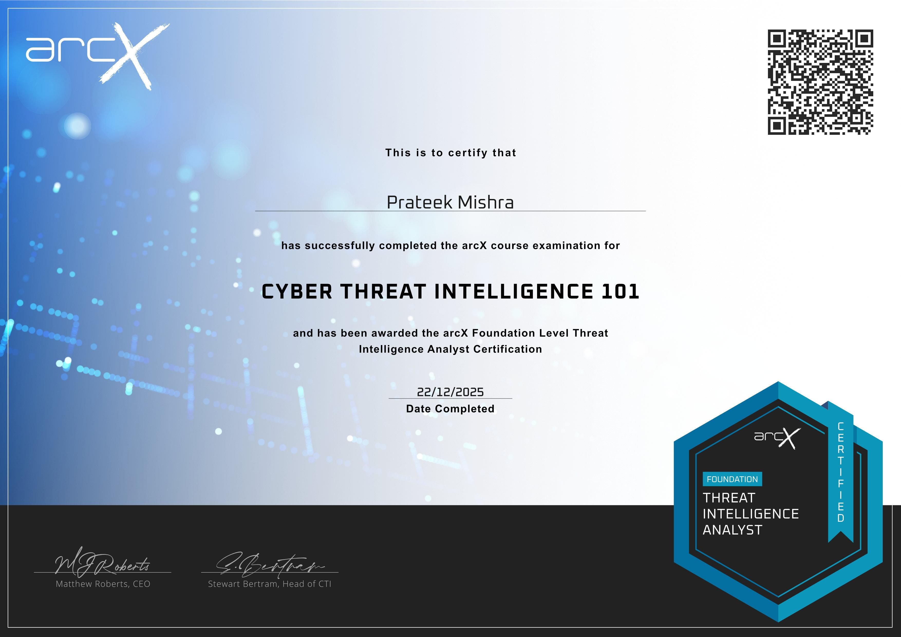

# [TLP:CLEAR] Threat Intelligence Dossier: Lazarus Group "Operation DreamJob" 2025
**Analyst:** Prateek Mishra  
**Reference ID:** CTI-DPRK-2025-12  
**Date:** December 27, 2025  
**Target Sectors:** Financial Services, Aerospace, European UAV/Defense  

---

## 1. Executive Summary (BLUF)
Since early 2025, the North Korean state-sponsored actor **Lazarus Group (APT38)** has evolved its "Operation DreamJob" campaign to target European defense contractors and global financial entities. The primary attack vector involves highly tailored social engineering on LinkedIn and Telegram. Using the **"ClickFake"** technique, attackers trick victims into installing trojanized tools or "camera drivers" during fake job interviews. Successful compromise leads to the deployment of the **ScoringMathTea** RAT or the **GolangGhost** backdoor, facilitating full system control and intellectual property theft.

---

## 2. Threat Actor Analysis
* **Actor Name:** Lazarus Group (Sub-groups: AppleJeus, Citrine Sleet)
* **Origin:** DPRK (attributed to the Reconnaissance General Bureau)
* **Strategic Motivation:** 1. **Financial:** Theft of cryptocurrency to bypass international sanctions.
    2. **Espionage:** Theft of UAV (drone) blueprints to support domestic military modernization.

---

## 3. Attack Lifecycle (MITRE ATT&CK® Mapping)

| Tactic | Technique ID | Description |
| :--- | :--- | :--- |
| **Initial Access** | T1566.002 | Spearphishing via LinkedIn/Telegram posing as Boeing/Airbus recruiters. |
| **Execution** | T1204.002 | Victim executes "CodingChallenge.exe" or "CameraDriver.zip". |
| **Persistence** | T1547.001 | Creation of malicious Windows Services (e.g., `TSMSISrv.dll`) for autostart. |
| **Defense Evasion** | T1574.002 | DLL Side-Loading using legitimate binaries (e.g., hijacking `MuPDF` or `Notepad++`). |
| **Exfiltration** | T1041 | Compressing proprietary blueprints into encrypted `.rar` files for C2 upload. |

---

## 4. Technical Artifacts & Indicators (IOCs)

### **Network Indicators (C2 Infrastructure)**
| Indicator Type | Value | Context |
| :--- | :--- | :--- |
| **Domain** | `coralsunmarine[.]com` | Malicious C2 for ScoringMathTea RAT |
| **IP Address** | `23.111.184.125` | Hosting site for ClickFake interview portal |
| **URL** | `hxxps://nvidia-career-portal[.]com/invite/` | Social engineering landing page |

### **File Hashes (SHA-256)**
* `28978E987BC59E75CA22562924EAB93355CF679E` (ScoringMathTea RAT)
* `5E5BBA521F0034D342CC26DB8BCFECE57DBD4616` (BinMerge Loader)

---

## 5. Detection & Mitigation Strategy

### **Detection:**
```yara
rule Lazarus_2025_DreamJob_Loader {
    meta:
        description = "Detects BinMergeLoader used in late 2025 Lazarus campaigns"
        actor = "Lazarus Group"
        version = "1.0"
    strings:
        $s1 = "HideFirstLetter.dll" ascii
        $s2 = "ScoringMathTea" wide
        $magic = { 4D 5A } // MZ Header
    condition:
        $magic at 0 and any of ($s*)
}


---
## 6. Analyst Certification
*This research was conducted as part of the advanced threat analysis curriculum for the following certifications:*



